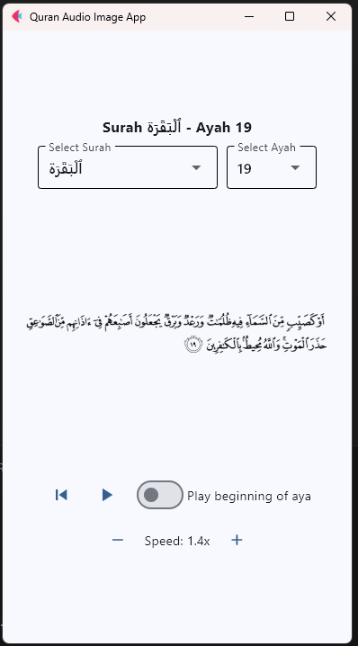

# Quran App

This application allows users to read and listen to the Quran. It features a user-friendly interface built with Flet, providing navigation through Surahs and Ayahs, audio playback with adjustable speed, and a persistent settings using an SQLite database.



## Features

*   **Interactive Quran Reading:** Browse and read the Quran with an intuitive interface.
*   **Audio Playback:** Listen to Quran recitations with controllable playback speed.
*   **Surah and Ayah Selection:** Easily navigate to specific Surahs and Ayahs using dropdown menus.
*   **Adjustable Playback Speed:** Customize the audio playback speed to your preference.
*   **Persistent Settings:** Saves the current Ayah and playback speed using an SQLite database.
*   **Audio Control:** Includes a feature to toggle replaying the beginning of the current Ayah.
*   **Database Integration:** Uses SQLite to store and retrieve application data.

## Installation

1.  **Prerequisites:** Ensure you have Python installed on your system.

2.  **Install Dependencies:** Install the required Python packages using `pip`:

    ```bash
    pip install -r requirements.txt
    ```
    This will install the following packages:
    - flet
    - pynput
    - flet-audio

## Usage
To start the application, run:
```bash
python main.py
